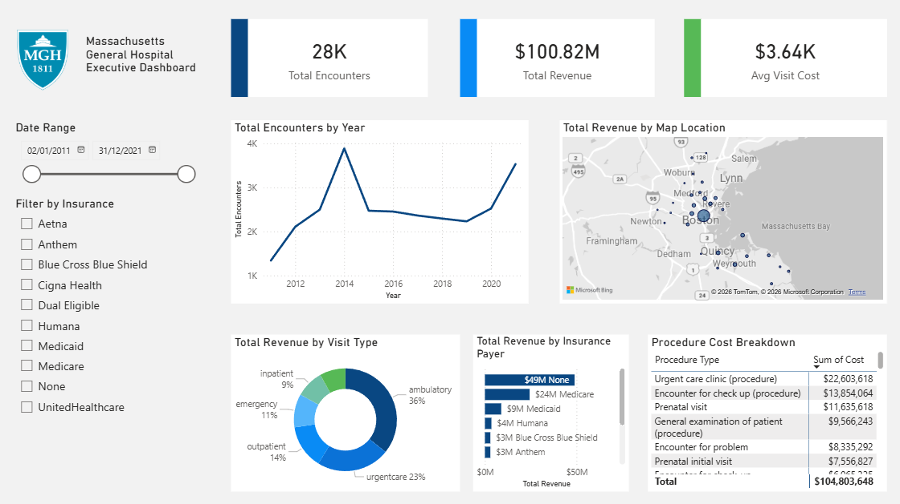

# Hospital Operations & Patient Health Analysis

## Project Overview
This project involves analysing 10+ years of synthesised hospital data to evaluate operational efficiency, financial health, and patient behavior. The workflow included setting up a local MySQL database, performing advanced SQL analysis, and visualising key insights in Power BI.

**Executive Dashboard Preview:**

*(Hospital Executive Dashboard created in Power BI)*

## Tools Used
*   **SQL (MySQL):** Data extraction, cleaning, and complex logic (Window functions, CTEs).
*   **Power BI:** Data modeling (Star Schema), DAX calculations, and interactive dashboard design.
*   **Data Engineering:** Database schema creation and synthetic data integration.

## Key Insights & Analysis

#### 1. SQL Analysis (Logic & Code)
Utilised SQL to answer critical business questions regarding patient flow and revenue.
*   **Identified Readmission Rates:** Engineered a query using `LAG()` and `DATEDIFF()` to identify that **64% of readmissions** occur within 30 days of discharge.
*   **Revenue Cycle Analysis:** Performed `JOINs` across Payer and Encounter tables to reveal that **48% of visits had $0 insurance coverage**, highlighting a major financial risk.
*   **Procedure Costs:** Used aggregation to rank the top 10 most expensive procedures, identifying ICU admissions (~$200k/visit) as the primary cost driver.

*View the full SQL script here: [analysis_queries.sql](analysis_queries.sql)*

#### 2. Power BI Dashboard (Visualisation)
The interactive dashboard allows stakeholders to filter by Date and Payer to explore:
*   **Geospatial Trends:** A map visual showing revenue distribution across Massachusetts cities.
*   **Payer Mix:** Analysis of revenue contribution by major insurance providers (Blue Cross, Medicaid, etc.).
*   **Operational Volume:** Tracking patient admission trends from 2011–2022.

## Data Source

Dataset: [Hospital Patient Records](https://mavenanalytics.io/data-playground/hospital-patient-records) from Maven Analytics Data Playground

- **Description:** Synthetic data on ~1,000 patients of Massachusetts General Hospital (2011-2022)
- **Records:** 75,592 across multiple tables
- **License:** Public Domain
- **Original Source:** [SyntheticMass](https://synthea.mitre.org/downloads) (generated using Synthea)

*See [data_dictionary.csv](data_dictionary.csv) for full table and field documentation.*

#### Citation
> Jason Walonoski, Mark Kramer, Joseph Nichols, Andre Quina, Chris Moesel, Dylan Hall, Carlton Duffett, Kudakwashe Dube, Thomas Gallagher, Scott McLachlan, *Synthea: An approach, method, and software mechanism for generating synthetic patients and the synthetic electronic health care record*, Journal of the American Medical Informatics Association, Volume 25, Issue 3, March 2018, Pages 230-238, https://doi.org/10.1093/jamia/ocx079
